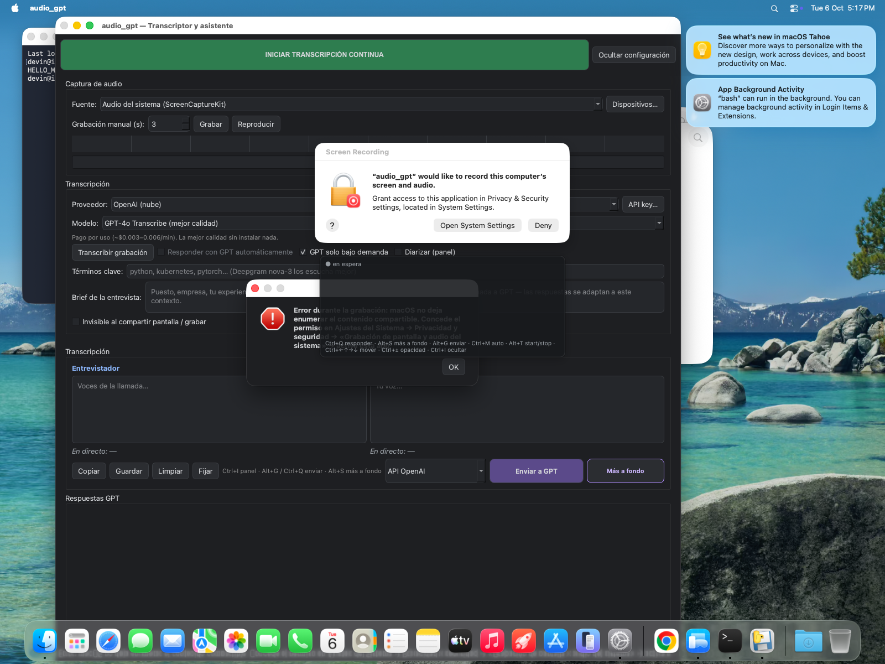
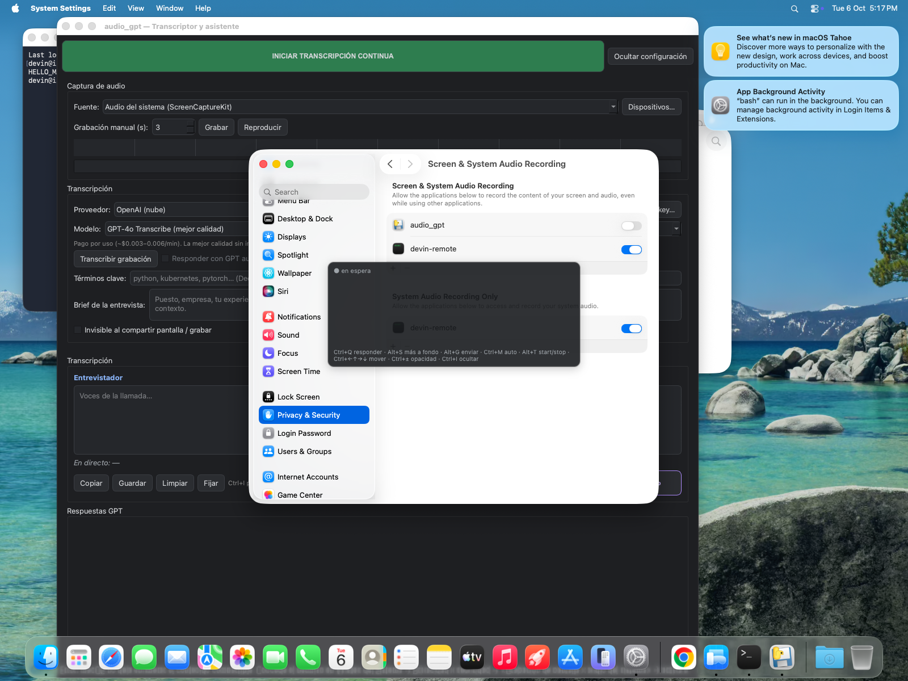
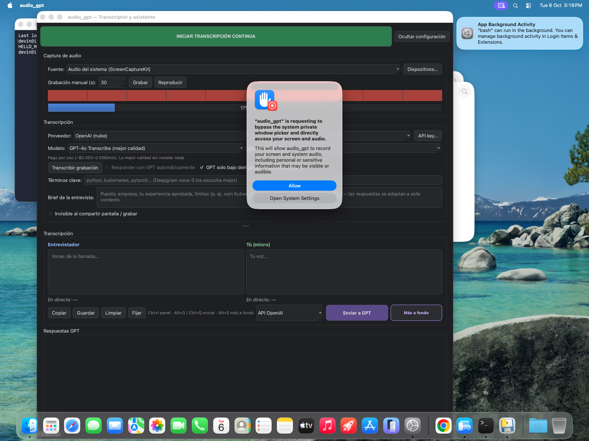
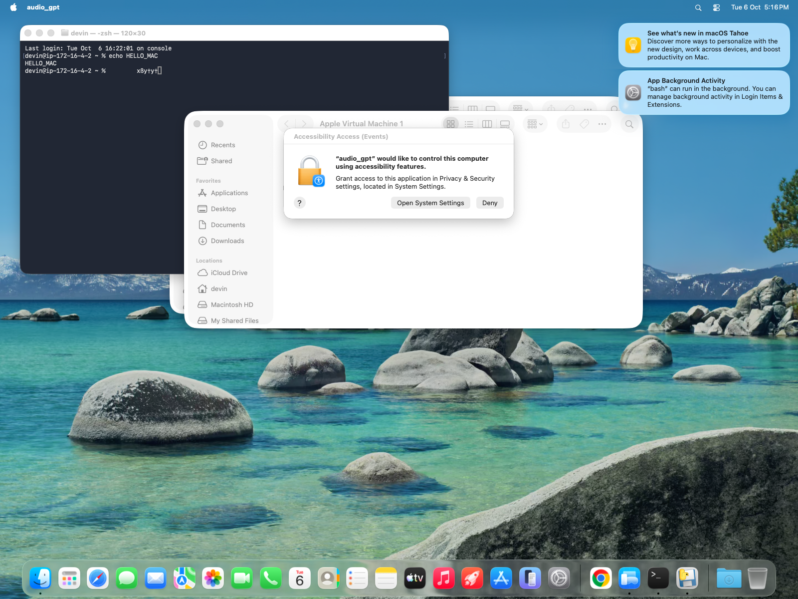
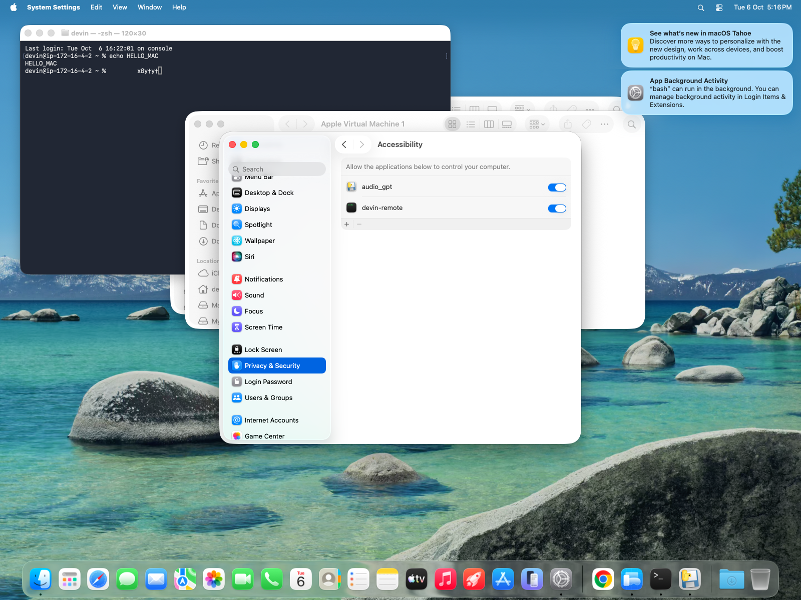
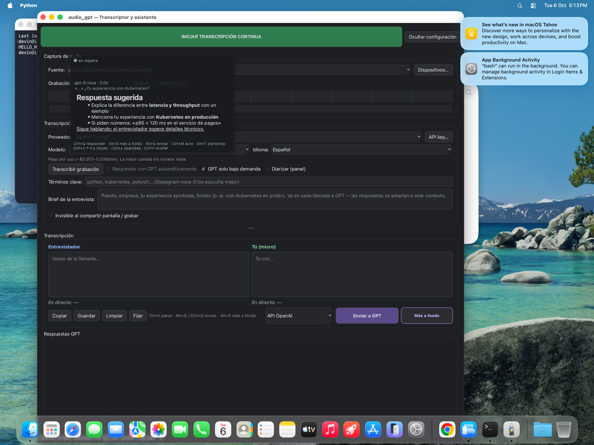

# Instalar audio_gpt en Mac (guía sencilla)

Esta guía es para el `.dmg` de audio_gpt en Mac (Apple Silicon: M1, M2, M3,
M4). No hace falta saber de programación.

---

## 1. Descarga el archivo

Baja `audio_gpt-0.1.0-arm64.dmg` desde la página de *Releases* del
repositorio en GitHub.

## 2. Arrastra la app a Aplicaciones

1. Haz doble clic en el `.dmg` descargado: se abre una ventana con la app
   `audio_gpt` y un icono de **Aplicaciones**.
2. Arrastra `audio_gpt` encima del icono **Aplicaciones**.
3. Expulsa el disco (icono de expulsar junto a «audio_gpt» en el Finder).

## 3. Ábrela la primera vez (Gatekeeper)

Como la app no está firmada con una cuenta de Apple Developer, macOS la
bloquea la primera vez:

1. Haz **doble clic** en `audio_gpt` dentro de Aplicaciones. Verás un aviso
   tipo *«No se puede abrir porque el desarrollador no se puede verificar»*
   o *«está dañada»*.
2. Ve a **Ajustes del Sistema → Privacidad y seguridad**.
3. Baja hasta el final: aparece *«audio_gpt se ha bloqueado…»* → pulsa
   **«Abrir igualmente»**.
4. Confirma con **«Abrir»** en el siguiente aviso.

> Alternativa si no aparece «Abrir igualmente»: abre Terminal y escribe
> `xattr -dr com.apple.quarantine /Applications/audio_gpt.app` y pulsa
> Enter.

## 4. Concede los 3 permisos

La app te irá pidiendo permisos la primera vez que uses cada función. En
cada aviso pulsa **«Abrir Ajustes del Sistema»** y activa el interruptor
junto a `audio_gpt`:

### a) Micrófono
- Ajustes del Sistema → **Privacidad y seguridad → Micrófono** → activa
  `audio_gpt`.
- Se pide al iniciar la transcripción. Sirve para transcribir **tu voz**.

### b) Grabación de pantalla y audio del sistema
- Ajustes del Sistema → **Privacidad y seguridad → Grabación de pantalla
  y audio** → activa `audio_gpt`.
- Aparece al pulsar «Grabar» o «Iniciar transcripción continua» por
  primera vez. Sirve para capturar **la voz del entrevistador** (el audio
  del sistema) sin instalar nada extra.
- macOS puede pedir que cierres y vuelvas a abrir la app; hazlo.





### c) Accesibilidad (para los atajos de teclado)
- Ajustes del Sistema → **Privacidad y seguridad → Accesibilidad** →
  activa `audio_gpt`.
- Se pide nada más abrir la app. Sin este permiso los atajos globales
  (Ctrl+I, Ctrl+Q…) no funcionan.
- Después de activarlo, **cierra la app y ábrela otra vez**.




## 5. Pega tu API key

1. En la app pulsa el botón **«API key…»**.
2. Pega tu clave (p. ej. de OpenAI) y guarda.
3. La clave se guarda solo en tu Mac
   (`~/Library/Application Support/audio_gpt/`); no se sube a ningún sitio.

## 6. Prueba rápida

1. Reproduce algo con sonido (YouTube, música).
2. Pulsa **«Grabar»** unos segundos y luego **«Transcribir»**: debería
   salir texto de lo que sonaba.
3. Pulsa **Ctrl+I**: aparece/desaparece el panel flotante oscuro.
4. Pulsa **Ctrl+Q** tras una transcripción: GPT responde a la última
   pregunta del entrevistador.



---

## Notas

- **Atajos** (iguales que en Windows; Alt = Option ⌥):
  Ctrl+Q responder · Alt+S responder más a fondo · Ctrl+M auto-responder ·
  Ctrl+I mostrar/ocultar panel · Alt+G enviar a GPT · Alt+T start/stop.
- El checkbox **«Invisible al compartir pantalla / grabar»** oculta la
  ventana a muchas capturas, pero **desde macOS 15.4 ScreenCaptureKit lo
  ignora**: con Zoom/Meet/QuickTime modernos la ventana SÍ puede verse en
  la captura. Tenlo en cuenta si compartes pantalla.
- Solo para **Apple Silicon** por ahora. Para Intel, genera el `.dmg` en
  un Mac Intel con `./build_mac.sh`.
- Si la app no se abre tras dar permisos, reinicia el Mac una vez.

## Generar el .dmg tú mismo (opcional)

```bash
./build_mac.sh        # crea dist/audio_gpt.app y dist/*.dmg
```
